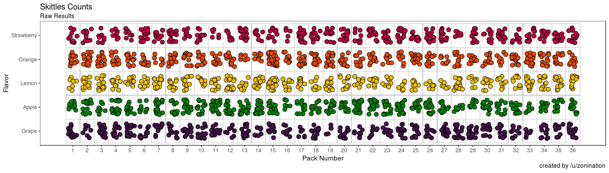
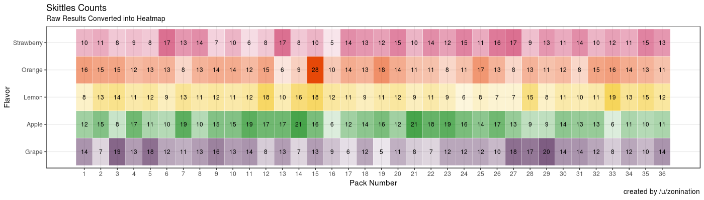
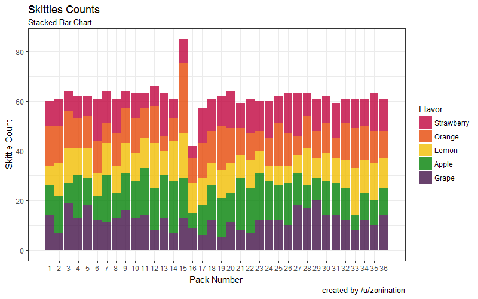
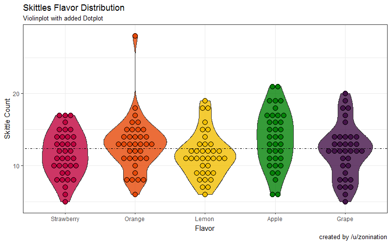
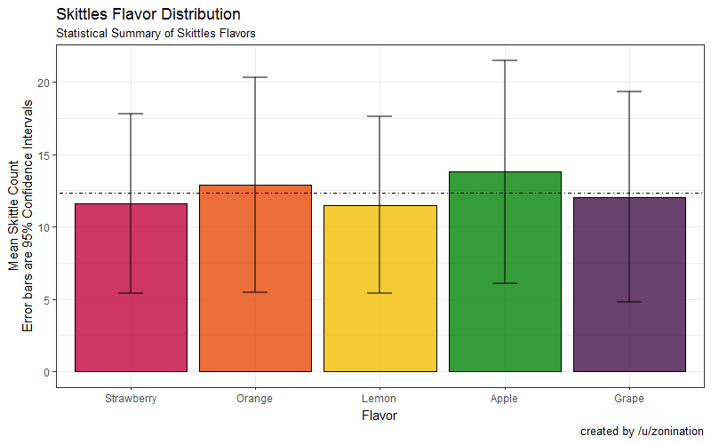

# Introduction

Got ticked off about skittles posts, so I decided to make a proper analysis for /r/dataisbeautiful

A lot of you probably remember my rant about skittles from this comment thread: https://np.reddit.com/r/dataisbeautiful/comments/5bmo3a/color_distribution_of_one_more_partysized_bag_of/d9pne1n/

In order to properly analyze the distribution of Skittles, you should divide up smaller packets, gather a standard deviation for each color, and then compare to one another. Getting a single bag of skittles is only an interesting anecdote, whereas gathering data in multiple variables over multiple trials... well, I'll let my comment speak for itself.

## Gallery

**Sorted:**

This is what the Skittles look like after sorting a box of 36 packs of full-size skittles. Unfortunately, just sorting the pieces into bins isn't that "beautiful", so below I'll explore some alternate ways of plotting the data:

**Heatmap:**

This is where we start to get into /r/dataisbeautiful territory. Or at least we start. Above is a visualization that effectively conveys information. Notice how you can easily pick outliers in the distribution. But the overall count of each packet isn't really displayed clearly. Is there a better way to do this?

**Stacked Bar Chart:**

This one that came out is one of my favorites. It turns out that Pack 15 had some extra skittles after all. And lots of orange. And worst yet, is that whoever would have bought Pack 16 would have been ripped off. Fill errors can be beautiful too, you know.

Makes you wonder, however: How does each color stack up? Do any flavors truly appear more than usual?

**Violin Plot with Dotplot for effect:**

Ah. This looks interesting. We can clearly see that orange outlier, while being able to visualize the distribution of each color individually. Looks like they're all not too far from the average.

Why don't we plot the mean ± 95% confidence interval while we're at it?

**Bars with Error Bars:**

This is what you should see when someone asks you "are the distribution of Skittles skewed toward a particular color?" The answer: it doesn't look like it unless you present anecdotes, like a single Pack.

##Information

* **Tools:** R with ggplot2
* **Source:** Own data. Box of 36 Skittles, acquired from Amazon.
